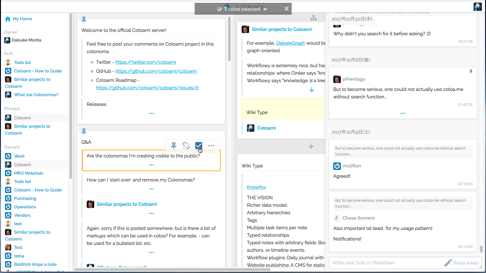
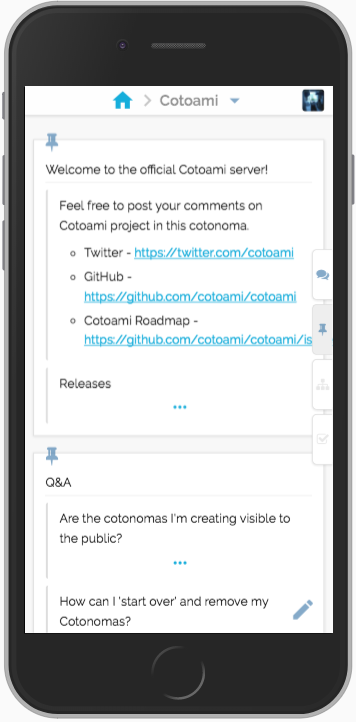
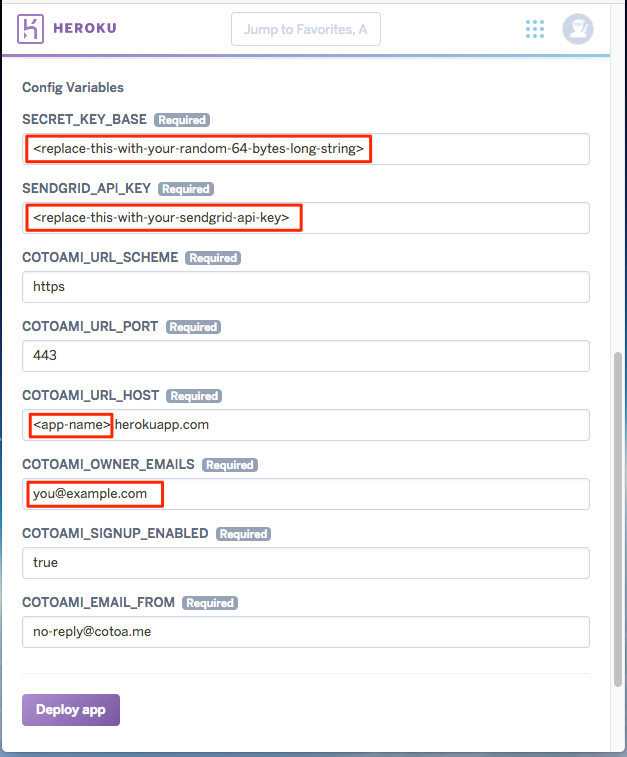

Cotoami
=======

[](https://circleci.com/gh/cotoami/cotoami)

Cotoami (言編み・言網) is a platform where people can weave a large network of knowledge from tiny ideas.

Cotoami is an open source project, sponsored by [UNIVA Paycast](https://www.univapay.com) under the Apache 2.0 Licence.


## Screenshots






## Try it

### Official demo server

There is an official Cotoami server to demonstrate its features and
*generative knowledge sharing* which this project aims to promote.

The official Cotoami server - [https://cotoa.me/](https://cotoa.me/)

### Launch your own server on Heroku

The easiest way to launch your own Cotoami server is to click the following Heroku Button:

[](https://heroku.com/deploy)

and set the required configurations.



Replace the highlighted values with your custom values:

* `SECRET_KEY_BASE`
    * Specify a random 64-bytes-long string.
        * e.g. `Y/j0csZXyV2On8uX1TIZXAkR6K8w45egzL76xIV/6jyfPuaZ5A5j5mAtoTsMw3CE`
* `SENDGRID_API_KEY`
    * This is a tricky part of the deployment. You need to obtain a SendGrid (an email sending service) API key by following the instructions in the "Obtain a SendGrid API key" section below.
* `COTOAMI_URL_HOST`
    * Replace `<app-name>` with your Heroku app name.
* `COTOAMI_OWNER_EMAILS`
    * Specify owner email addresses (comma separated).

You should know the limitations of Cotoami on Heroku as described in:

* <https://hexdocs.pm/phoenix/heroku.html#limitations>
    
#### Obtain a SendGrid API key

1. First, you need to get SendGrid's username and password by deploying an app (Click the "Deploy app" button in the Heroku site).
2. After finishing the deployment, you can check your username and password via config vars: `SENDGRID_USERNAME` and `SENDGRID_PASSWORD`, which can be viewed in the app's settings page in the Heroku site (click the "Reveal Config Vars" button).
3. Go to <https://app.sendgrid.com/settings/api_keys> and log in with the username and password.
4. Create an API key.
5. Set the obtained key to the config `SENDGRID_API_KEY` in the Heroku app's settings page (then the app will restart automatically).

* ref. [SendGrid \| Heroku Dev Center](https://devcenter.heroku.com/articles/sendgrid)


## Concept

* **Coto**: Post. A unit of information in Cotoami.
* **Cotonoma**: A Cotonoma is a chatroom-like unit which has its own timeline and pinned Cotos.


As you can see in the image above, Cotonomas are posted to a timeline like Cotos.
Actually, you can treat Cotonomas as Cotos. They can be pinned to another
Cotonoma or connected to other Cotos.

### Cotoami's concept of knowledge generation


1. Collect random ideas by posting Cotos to a timeline.
2. Look for connections between Cotos and make them as they are found.
3. Cotonomatize: Convert a hub Coto that has many outbound connections and looks worth discussing into a Cotonoma.
4. Repeat the same thing in the new Cotonoma.


## Development

* Cotoami Roadmap - https://github.com/cotoami/cotoami/issues/2
* News and updates - https://twitter.com/cotoami


## Requirements

* Node.js 5.0.0 or greater
* Elixir 1.3.x
    * https://elixir-lang.org/install.html
* Phoenix 1.2.x
    * http://www.phoenixframework.org/docs/installation


## Run application on localhost

If you have a Docker environment running (`docker info` outputs some info), just execute the following command:

```
$ ./launch-on-local.sh
...
[info] Running Cotoami.Endpoint with Cowboy using http://localhost:4000
[info] Running migrations on start...
[info] Already up
...
```

Now you can visit `localhost:4000` from your browser.

### Dummy mail server

There should be a line like `You can check sign-up/in mails at <url>` in the output log.
You can access the test mail server via the `<url>` to check sign-up/in mails.

## License

Cotoami source code is released under Apache 2 License.

Check [LICENSE](LICENSE) file for more information.
